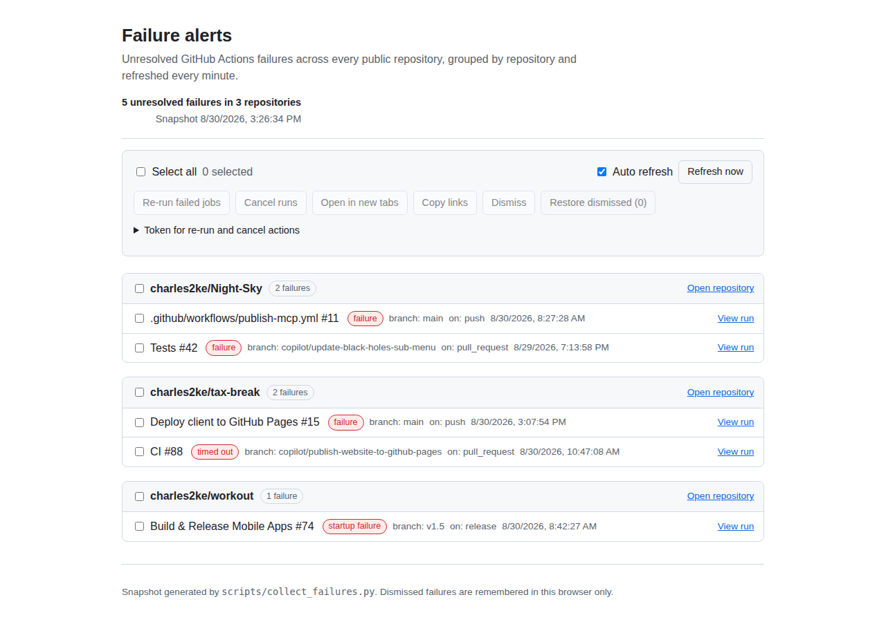

# Failure alerts dashboard

Static page published to GitHub Pages at
[`/failures.html`](https://charles2ke.github.io/charles2ke/failures.html).

- `failures.html` — markup and templates.
- `failures.css` — light/dark styling.
- `failures.js` — data loading, rendering, selection and bulk actions.
- `screenshots/` — rendered examples of the page, captured with Playwright.

The page reads `failures.json`, generated at deploy time by
[`scripts/collect_failures.py`](../scripts/README.md) and published alongside
these files. It re-fetches that snapshot every 60 seconds (auto refresh can be
paused), so resolved failures disappear and new ones appear without a reload.

The `Deploy to GitHub Pages` workflow redeploys whenever anything under `site/`
changes, and `tests/test_readme_links.py` checks that every link in the
repository's Markdown — including the dashboard link in the profile README —
points at a page the workflow actually publishes.

Failures are grouped by repository, with a select-all checkbox per repository
and a global one. Bulk actions apply to everything selected:

| Action | Effect |
| --- | --- |
| Re-run failed jobs | `POST /repos/{owner}/{repo}/actions/runs/{id}/rerun-failed-jobs` |
| Cancel runs | `POST /repos/{owner}/{repo}/actions/runs/{id}/cancel` |
| Open in new tabs | Opens each run page |
| Copy links | Copies the selected run URLs to the clipboard |
| Dismiss / Restore | Hides (or restores) failures locally, for triage |

The two write actions need a GitHub token with the `repo` scope (or a
fine-grained token with `Actions: read and write`). The token is entered in the
page and held in that tab's `sessionStorage` only — it is never sent anywhere
except `api.github.com`, and never stored in the repository. Dismissals are
kept in `localStorage` and affect only your browser.
